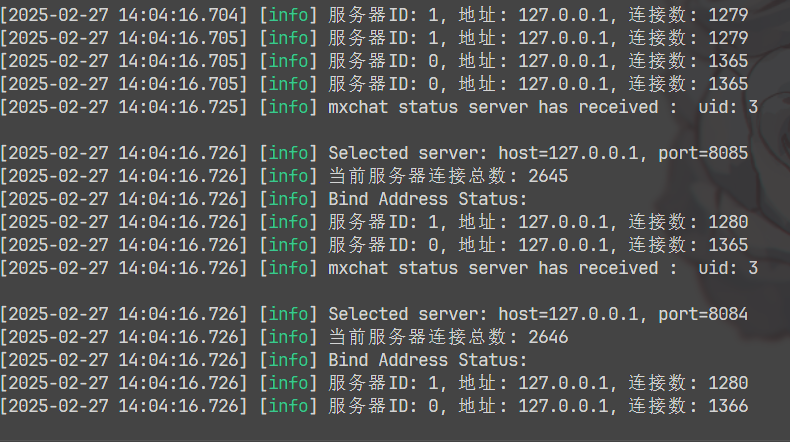
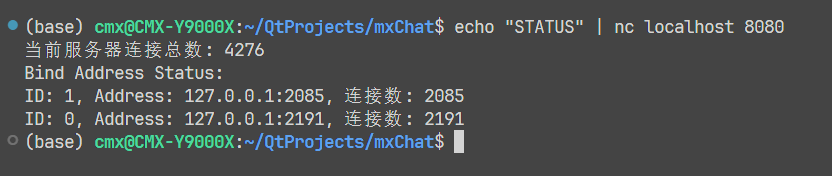
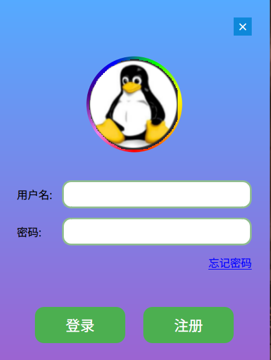
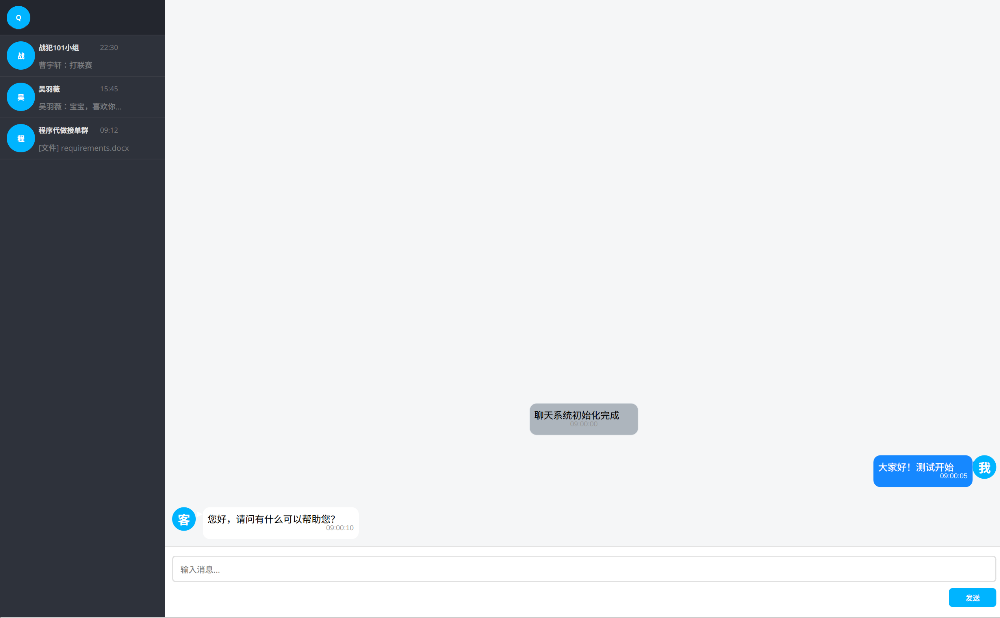
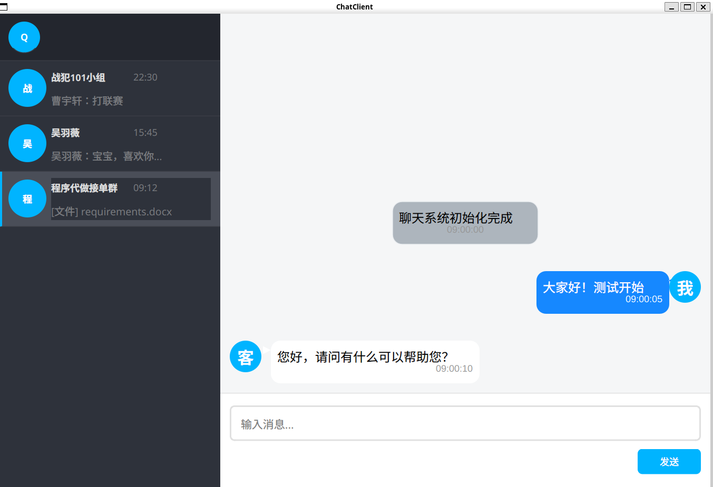
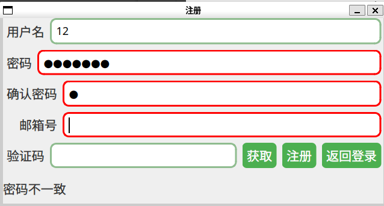
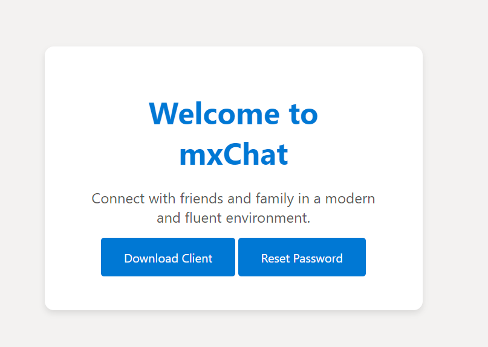
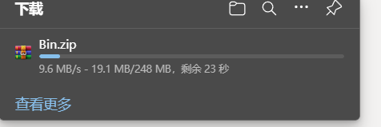
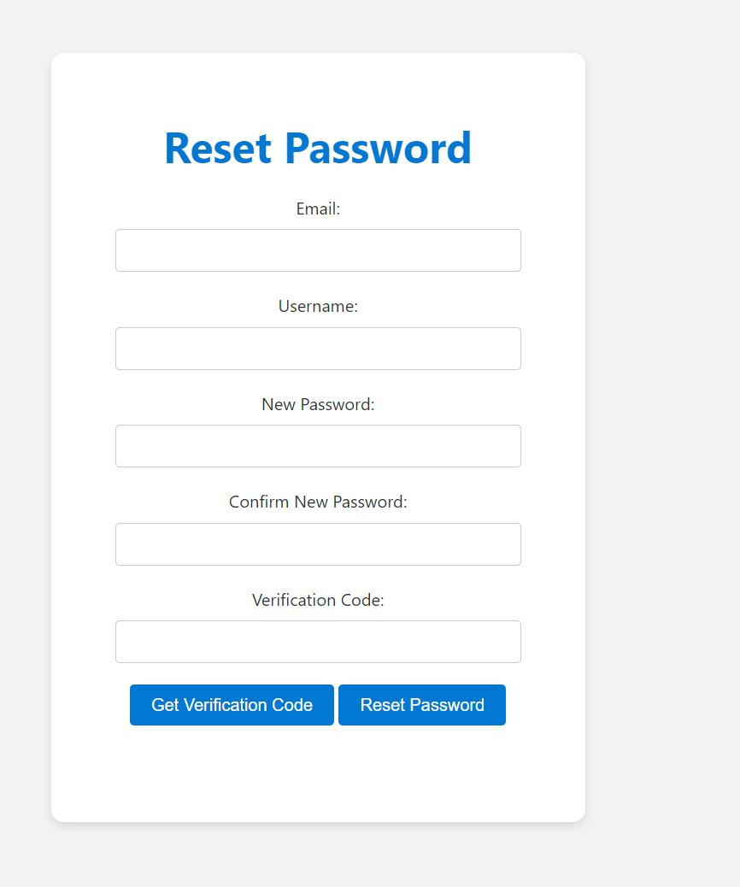

# 项目介绍

## 这是一个仿造新版QQ制作的聊天服务器+客户端解决方案

## 包含内容

### 服务器端
* **Status Server** 负载均衡服务器，为客户端选择一个服务端进行分配，目前的策略是取余选择,可以通过echo "STATUS" | nc localhost 8080来获取服务状态

* **Chat Server** 聊天服务器，负责与客户端进行通信

* **VarifyServer** NODE JS的邮件发送服务器，用ASIO做连接池

* **WebServer** 以Crow作为提供由代码打包二进制压缩文件的高速流式下载和密码重置功能

### 客户端
* **ChatClient** 基于新版QQ的客户端的界面设计，使用Qt Widgets进行开发

### WEB端

* **WebServer** 采用Crow,实现服务器的高速流式下载和Mysql密码修改功能

### 数据库

* **Mysql** 用于存储用户信息

* **Redis** 用于存储在线用户信息和注册信息，未来支持登录信息

* **Sqlite** 用于存储聊天记录,未来支持客户端本地存储

# 引用
本项目部分服务器端的风格和邮件发送源码参考了llfchat的设计，详见项目地址：https://gitee.com/secondtonone1/llfcchat